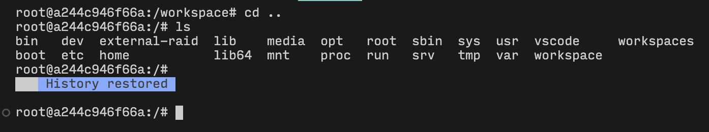

# How to setup VSCode Docker using Devcontainers

>📌 It is assumed you have SSHed into the host

To setup a docker container using devcontainers, follow the steps below. The basic flow is that you either git clone a repo or make an empty folder first in the server and then create a `devcontainer.json` and `Dockerfile` which will build the docker container every time you want to access the folder. 

- In this tutorial, I’m going to create an empty folder called `code-switch-llm` and `cd` into it
- After that, create a folder called `.devcontainer` and create a file inside it called `devcontainer.json`
- Write the following contents into `devcontainer.json`

```json
{
    "name": "Python 3.11 Code Switch LLM",  // change this to a new name
    "image": "python3.11-code-switch-llm",  // change this to a new name
    "workspaceFolder": "/workspace",
    "mounts": [
      "source=${localWorkspaceFolder},target=/workspace,type=bind",
      "source=/raid,target=/external-raid,type=bind"
    ],
    "runArgs": [
      "--gpus=all"
    ],
    "settings": {
      "python.defaultInterpreterPath": "/usr/local/bin/python",
      "python.linting.enabled": true,
      "python.linting.pylintEnabled": true,
      "python.formatting.provider": "black"
    },
    "extensions": [
      "ms-python.python",
      "ms-toolsai.jupyter"
    ],
    "postCreateCommand": "pip install numpy pandas matplotlib jupyter jupyterlab",
    "remoteEnv": {
      "PYTHONUNBUFFERED": "1"
    }
  }
  
```

- After this, change the `name` and `image` fields to something new
- Also, in the parent directory create a new file called `Dockerfile` and paste the below contents into it

```json
# Use an official Python 3.11 base image
FROM python:3.11-slim

# Set environment variables
ENV PYTHONUNBUFFERED=1
ENV DEBIAN_FRONTEND=noninteractive

# Update and install system dependencies
RUN apt-get update && apt-get install -y \
    build-essential \
    curl \
    git \
    unzip \
    ffmpeg \
    libsm6 \
    libxext6 \
    libgl1 \
    && apt-get clean \
    && rm -rf /var/lib/apt/lists/*

# Install Python packages
RUN pip install --no-cache-dir --upgrade pip \
    && pip install --no-cache-dir \
    numpy \
    pandas \
    matplotlib \
    jupyter \
    jupyterlab \
    ipykernel

# Set the working directory inside the container
WORKDIR /workspace

# Expose Jupyter notebook port
EXPOSE 8888

# Default command to start Jupyter Notebook
CMD ["jupyter", "notebook", "--ip=0.0.0.0", "--allow-root"]
```

- After this, your folder structure should look like below
    
    
    
- After this, build the docker container using the command. Change the `-t` argument to the name of docker image given in the `devcontainer.json`.

```json
docker build -t python3.11-code-switch-llm .
```

- Now at the bottom left, click on the SSH button
    
    
    
    - And from the top bar, choose `Reopen in Container`
    
    
    
- Now you should be attached to the container.
- If you `cd` out and `ls` you should be able to see the `workspace` folder that specificed in the configuration.
    
    
    
- Also the `external-raid` folder is created which is to be used to hold large files. Under `external-raid/scratch/SIT` make a new folder like how `aditya` has been created here and host your large files like model weights there.

    